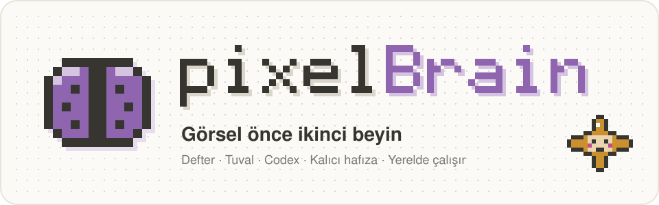
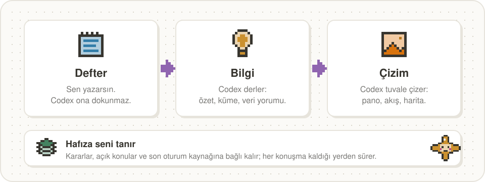
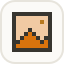
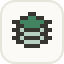
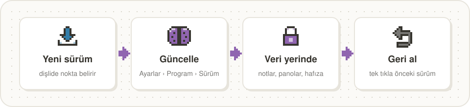

<p align="center"></p>

<p align="center"><b>Görsel önce ikinci beyin.</b> Sen yazarsın, Codex derler ve çizer, hafıza seni hatırlar.<br>
<sub>A visual-first second brain for macOS: notebook, canvas and Codex with persistent memory. Runs locally; your notes stay in your folder. The interface is in Turkish.</sub></p>

<p align="center">
<a href="https://github.com/berkaysirtas/pixelBrain/releases/latest"></a>

<a href="https://github.com/berkaysirtas/pixelBrain/actions/workflows/denetim.yml"></a>
<a href="LICENSE"></a>
</p>

Her konu bir **alan**: yazdığın Defter, Codex'in derlediği Bilgi ve düşüncenin çizildiği tuval. Sağda Codex oturur; konuşur,
panoya çizer, notlarını okur. Altta kalıcı bir hafıza vardır: pixelBrain seni tanır, oturumlar arasında ne konuştuğunuzu
hatırlar. Notların düz Markdown dosyalarıdır, kendi klasöründe kalır; Obsidian ya da herhangi bir metin editörüyle açılır.

## Nasıl çalışır

<p align="center"></p>

## Neler var

<table>
<tr><td width="56"></td><td><b>Defter</b><br>Alanın senin notu. Codex ona kendiliğinden yazmaz; "Defter'e yaz" dersen yazar.</td>
<td width="56"></td><td><b>Bilgi</b><br>Codex'in sayfası: özet, kümeler, veri yorumu, kararlar ve açık sorular.</td></tr>
<tr><td></td><td><b>Çizim</b><br>Sonsuz tuval. Codex panoyu canlı çizer; seçtiğin panoyu revize eder, genişletir, karşılaştırır.</td>
<td></td><td><b>Codex yanında</b><br>Sağ panelde Kıvılcım: konuşur, dosyalarını okur, ne yaptığını adım adım gösterir.</td></tr>
<tr><td></td><td><b>Kalıcı hafıza</b><br>Kimliğin, kuralların, açık konular ve son oturum <code>ben/</code> klasöründe; öğrenilen bilgi kaynağına bağlı.</td>
<td></td><td><b>Ortak beyin</b><br>Bütün alanların, notların ve bağların ağı; doğrulama bekleyen varsayımlar işaretli.</td></tr>
<tr><td></td><td><b>İzole çalışma alanı</b><br>İzole alanda Codex yalnız o alanın dosyalarını okuyabilir; macOS sandbox'ı bunu zorlar.</td>
<td></td><td><b>Veri ve video</b><br>Dosya, link ya da YouTube videosu bırak; Codex okur, özetler, Bilgi'ye yazar.</td></tr>
</table>

Her yere <kbd>⌘</kbd><kbd>K</kbd> ile gidilir.

## Kurulum

### En kolayı: Codex ya da Claude Code kursun

1. Boş bir klasör aç (örneğin `~/pixelBrain`). Not klasörün varsa o da olur; hiçbir dosyanın üstüne yazılmaz.
2. Klasörü [Codex](https://github.com/openai/codex) ya da [Claude Code](https://claude.com/claude-code) ile aç.
3. Şu mesajı yapıştır:

```text
https://raw.githubusercontent.com/berkaysirtas/pixelBrain/main/KURULUM.md adresini oku ve pixelBrain'i bu klasöre kur.
İndirme ve kurulum adımlarını sen yap; bitince sağlığını doğrula, pixelBrain'i aç ve bana kısa bir özet ver.
```

Ajan ortamı kontrol eder, kurar, doğrular ve açar. İnternete çıkan ve hafıza dizinine yazan kurulum komutu için senden izin
ister; onay vermen yeterli. Ajanın izlediği adımlar [KURULUM.md](KURULUM.md) içinde.

### Tek satır

```sh
curl -fsSL https://raw.githubusercontent.com/berkaysirtas/pixelBrain/main/kur.sh | sh
```

`~/pixelBrain` klasörüne kurar. Başka bir klasör için sona yolunu ekle: `… | sh -s -- ~/Belgeler/pixelBrain`

### Elle

[Son sürümü](https://github.com/berkaysirtas/pixelBrain/releases/latest) indir, aç, klasörde `sh kur.sh` çalıştır.

### Gerekenler

| | |
|---|---|
| macOS | Linux'ta sınanmadı, Windows desteklenmiyor |
| Python 3.11+ | `python3 --version`; eskiyse `brew install python@3.12` |
| Codex CLI | Beyin'in yapay zekâsı: `npm install -g @openai/codex`, ardından `codex login` |
| Node.js (isteğe bağlı) | Panoların küçük resimleri için; kurulum betiği gerisini halleder |

### Kurulumdan sonra

1. Klasördeki **Beyni Aç** dosyasına çift tıkla. pixelBrain arka planda başlar, tarayıcıda `http://127.0.0.1:4700` açılır.
   Kendi penceresinde açmak için Chrome'da adres çubuğundaki **Yükle**, Safari'de Dosya › Dock'a Ekle.
2. İlk açılışta kısa bir tur seni karşılar; son adımda pixelBrain seni tanımak için birkaç soru sorar.
3. Klasörü Claude Code ya da Codex ile açtığında istemci hafıza hook'larına güvenmeni ister (Codex'te `/hooks`). Onayla;
   hafıza bununla oturumlar arasında taşınır.
4. Kapatmak için **Beyni Kapat** ya da Ayarlar › Program › Beyin'i kapat.

## Güncelleme

<p align="center"></p>

pixelBrain günde bir kez yeni sürüme bakar; varsa ayarlar düğmesinde bir nokta belirir. Ayarlar › Program › **Sürüm**
kartında "Güncellemeleri kontrol et" ve **Güncelle** var.

- Yalnız program dosyaları değişir. Notların, sayfaların, panoların, hafızan ve ayarların olduğu gibi kalır.
- Değişen her dosyanın eski hâli `.durum/guncelleme/` altına yedeklenir (son beş güncelleme); **Geri al** önceki sürüme döner.
- Bir program dosyasını kendin değiştirdiysen yenisiyle değişir, eski hâli yedekte kalır ve kart bunu söyler;
  **Codex'le birleştir** senin değişikliğini yeni sürüme taşıtır.
- Hafıza katmanı da pixelBrain'le birlikte güncellenir; sonra pixelBrain kendini yeniden başlatır.

Komut satırından: `python3 motor/guncelle.py kontrol`, `python3 motor/guncelle.py kur`, `python3 motor/guncelle.py geri`.

## Verin nerede

| Ne | Nerede |
|---|---|
| Defter ve Bilgi sayfaları | `sayfalar/<alan>/` |
| Kararlar, sorular, notlar | `notlar/<alan>/` |
| Panolar ve tuval | `panolar/*.dc.html`, `panolar/canvas.json` |
| Eklenen dosyalar, videolar | `ham/kaynaklar/` |
| Kimlik ve hafıza | `ben/`, `knowledge/`, `receipts/`, `daily/` |
| Çalışma alanları | `calisma.json` |

Bunların hiçbiri programın parçası değildir; güncelleme onlara dokunmaz. Yedek için klasörü kendi özel git deponda
tutabilirsin (Ayarlar › Entegrasyonlar › GitHub, private).

Klasörün dışına yalnız iki şey yazılır: hafızanın arama dizini (`~/Library/Application Support/beyin-v3/`, notlardan
yeniden kurulabilen bir indeks; notların kendisi değil) ve Node.js varsa tarayıcı motorunun önbelleği
(`~/Library/Caches/ms-playwright`, `~/.npm`). İnternete yalnız güncelleme kontrolü, senin bıraktığın linkler ve Codex çıkar.

## Sorun giderme

- **Codex paneli cevap vermiyor:** `codex login` yapıldı mı? Ayarlar › Entegrasyonlar'da Codex kartının durumuna bak.
- **"Beyin kapalı" sayfası:** sunucu çalışmıyor; **Beyni Aç**'a çift tıkla.
- **Port 4700 dolu:** `PORT=4710 ./baslat.sh` ve `http://127.0.0.1:4710`.
- **Pano küçük resimleri yok:** Node.js kur, sonra klasörde `sh kur.sh` (eksikleri tamamlar).
- **Hafıza sorunu:** `python3 beyin.py doctor --human`; ya da ajana "beyin doktor" de.
- **Güncelleme bozuk geldi:** Ayarlar › Program › Sürüm › Geri al, ya da `python3 motor/guncelle.py geri`.

## Geliştirme

Program `motor/` (Python sunucu, tek dosya kabuk `beyin.html`, tuval), `araclar/` (duman sınamaları:
`sh araclar/tum-duman.sh`) ve `hafiza/` (hafıza katmanının paketi). Şema ve tasarım kararları `BEYIN.md`, pano biçimi
`PANO.md`. Sunucu yalnız Python standart kütüphanesiyle çalışır. Katkı için [CONTRIBUTING.md](CONTRIBUTING.md), güvenlik açığı
bildirimi için [SECURITY.md](SECURITY.md). Her gönderimde GitHub macOS'ta kurulumu ve açılışı denetler.

## Lisans

pixelBrain kaynağı açık bir projedir ve [pixelBrain Lisansı](LICENSE) ile dağıtılır: Apache 2.0 ve üstüne birkaç ek koşul
(Multica ile aynı yapı). Bağlayıcı olan İngilizce [LICENSE](LICENSE) metnidir; kısaca:

- **Serbest:** kişisel kullanım, şirket içinde kullanım, kodu okumak, değiştirmek, fork'lamak ve fork'u açık depoda paylaşmak.
- **Ad, logo ve telif kalır:** pixelBrain adı, pixel beyin logosu ve arayüzdeki telif bilgisi kaldırılamaz, değiştirilemez;
  pixelBrain başka bir ürün adıyla dağıtılamaz. Kendi adını ancak "…, pixelBrain tabanlı" biçiminde yanına ekleyebilirsin.
- **Lisans değiştirilemez:** pixelBrain ve ondan türetilen her çalışma yalnız bu lisansla dağıtılır; dosya eksiksiz verilir.
- **Ticari lisans gerekir:** pixelBrain'i başkalarına barındırılan hizmet (SaaS) olarak sunmak ya da satılan bir ürüne gömmek
  için, ücretsiz olsa bile. Ticari lisans ve marka izni için: [github.com/berkaysirtas](https://github.com/berkaysirtas).

Hafıza katmanı (`hafiza/`) üçüncü taraf bir bileşendir ve kendi MIT lisansıyla gelir: [hafiza/LICENSE](hafiza/LICENSE).
